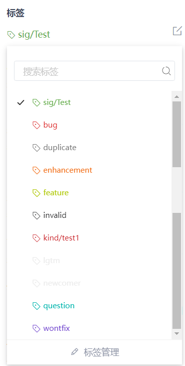
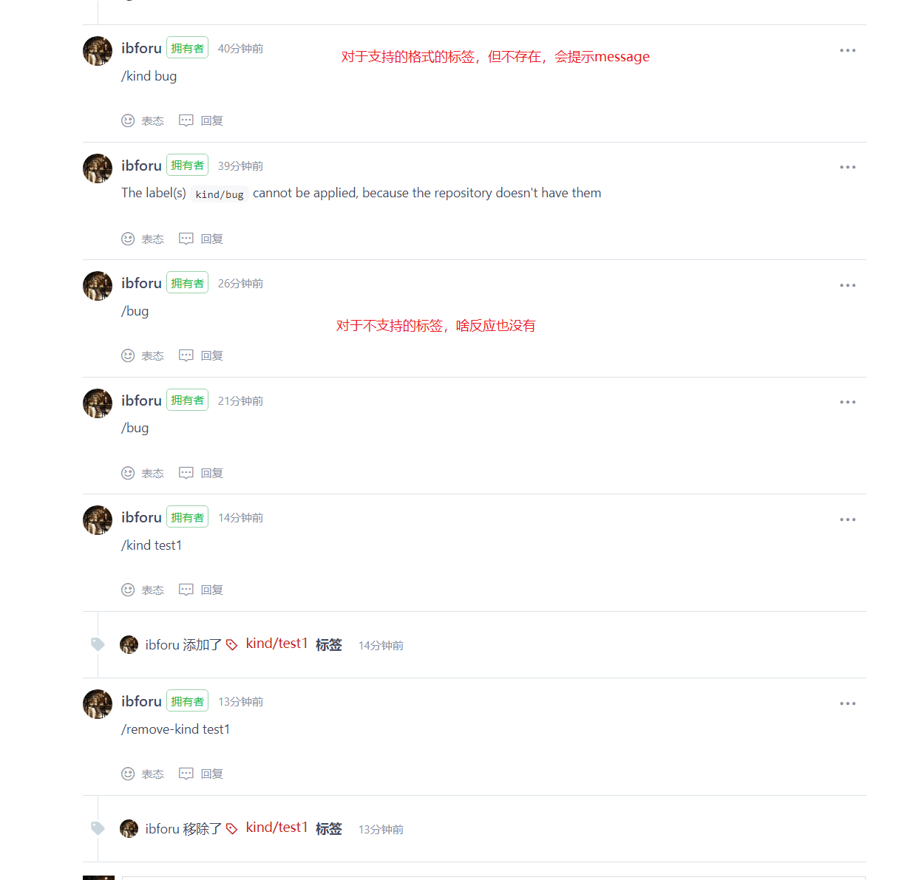
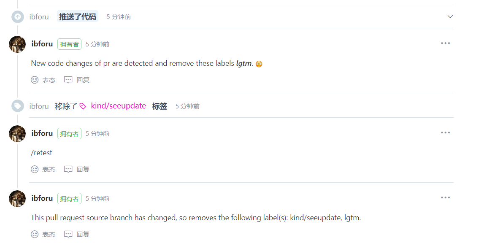

### 触发
- Issue 或 PR 的评论命令
- 前提：标签存在 （不存在时去标签管理里添加）
-  
- 目前支持的标签：kind/priority/sig/good 接二级标签（可自定义）
  例如上面图中所示：kind/test1
- 第一次到社区的作者打上 newcomer 标签
- 管理的源码目录中 sig/** 也会加上 sig/** 标签


### gitee 默认的标签
- bug	表示 bug
- enhancement	表示功能优化
- feature 表示要新增功能
- duplicate	表示 PR、Issue 重复
- invalid	表示废止 PR、Issue
- question	表示 PR、Issue 有疑问
- wontfix	表示不会再继续处理 PR、Issue

### github 默认的标签（包含上面的）
- documentation	表示文档需要改进或补充
- good first issue	表示适用首次贡献者的议题
- help wanted	表示维护员需要议题或拉取请求方面的帮助


### label 自定义
- lgtm: Looks good to me. // Riview 完别人的 PR ，没有问题
- sgtm: Sounds Good To Me. // 已经通过了 review 的意思
- wip: Work in progress, do not merge yet. // 开发中，如果你有个改动很大的PR，可以在写了一部分的情况下先提交
  - 在标题里写上 WIP，以告诉项目维护者这个功能还未完成，方便维护者提前 review部分提交的代码
- ptal: Please take a look. // 帮我看下，一般都是请别人 review 自己的 PR
- cc: Carbon copy // 一般代表抄送别人的意思
- tbr: To Be Reviewed. // 提示维护者进行 review
- approve: // PR 审核通过
- stat/needs-squash: // PR的commit数量超过设定的值，会打上标签提醒作者进行squash
- cla: 检查该PR所有提交的作者是否已经签署cla，如果通过就会打上cla通过标签
  - cla通过标签通常是PR自动合入的必要条件，因此该机器人不可缺少

### 效果
- 
- 当PR有新的commit，根据配置将自动删除这些配置标签。前提是标签必须要在 config.yaml 的 clear_labels 中存在
- 

### 项目配置
- 业务流程：access -> **label**

- 项目启动参数：--port=8832 --config-file={...}config.yaml --gitee-token-path={...}token
  
- token 文件中存储的是 webhook 的密钥
- 配置文件 config.yaml
  ```yaml
    config_items:
      - repos: # 仓库（可以到 owner，也可以到 repo）
        - ibforu
        excluded_repos: # 排除的仓库 （可选）
          - owner/repo1
        community_name: ibforu # 社区名（必填项）
        community_repo: community # 仓库名
        branch: master
        command_link: https://gitee.com/ibforu/community/blob/master/en/sig-infrastructure/command.md # 社区机器指令说明链接 （必填项）
  ```
- cache-endpoint 是 cache 服务的 url